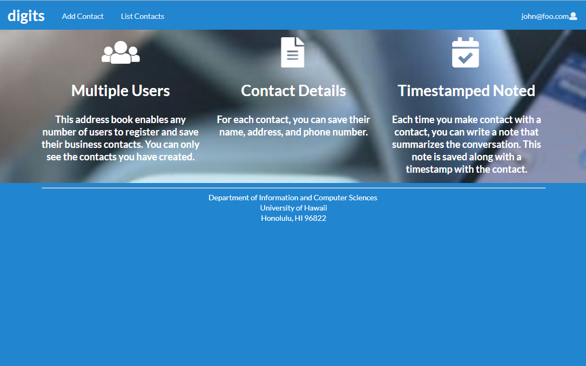

<h3>Installation</h3>
In order to run this program, you would first need to install Meteor.

Next, in a command line prompt, you would cd to your 'digits' directory and then the directory 'app' within the 'digits' directory.

You would then install the required libraries with the command:

<code>$ meteor npm install</code>

<h3>Running the application</h3>
You are now able to run the application with the command:

<code>$ meteor npm run start</code>

You can now view the application in your browser at http://localhost:3000. The screen you see should appear like the image above.

<h3>Registering an account</h3>

In order to access any of the services of this application, you would need to log in or register an account. To register an account, you would click the upper-right corner and click 'Sign Up' from the dropdown menu. You then input your email address and a password.

<h3>Logging in</h3>

Logging into an account works much in the same way, except, you would have to input the email and matching password of an existing account.

Once logged in, your home page will look like this, where you can now access the applications services.

<h3>Adding a contact</h3>

To add a contact, you would click 'Add Contact' in the upper left menu. In that menu, you would have to input a first name, last name, address, image, and description of the contact and press submit.

<h3>The List Contacts page</h3>

Once you have contacts, in the 'List Contacts' page that you can reach from that option in the upper left menu, your existing contacts are displayed as in the image. There is also a note feature, in which a timestamped note will be attached to that contact. A note can be created simply by typing something into the 'Add a timestamped note' section of that contact's card and pressing 'Submit'. You can also edit the contact's information using the 'Edit' link on each contact's card. This will redirect you to a page that will be discussed next.

<h3>Editing a contact</h3>

The 'Edit Contact' page is much like the 'Add Contact' page, except this time, the existing information for the contact already fills out the form. All you would have to do is change the information you need.
